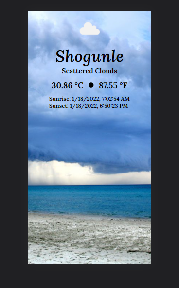
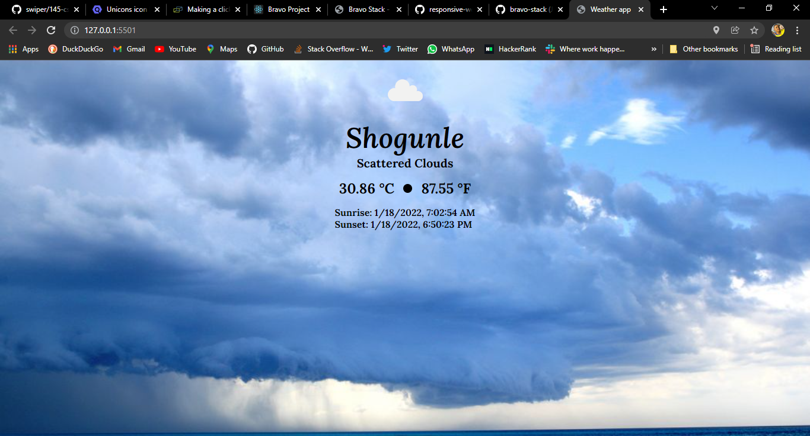

# Weather Application

## This project was built using vanilla javascript. The data used was actually fetched using The Fetch API

## App preview below

### This is what the mobile version looks like, albeit, it ain't reponsive tho

### and, here's what the desktop version looks like

### Don't forget to follow me on Twitter guys: [twitter.com/chukwuebukaonuh](https://www.twitter.com/chukwuebukaonuh)